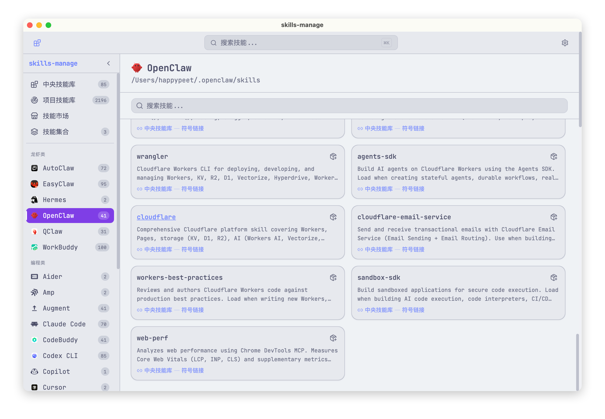
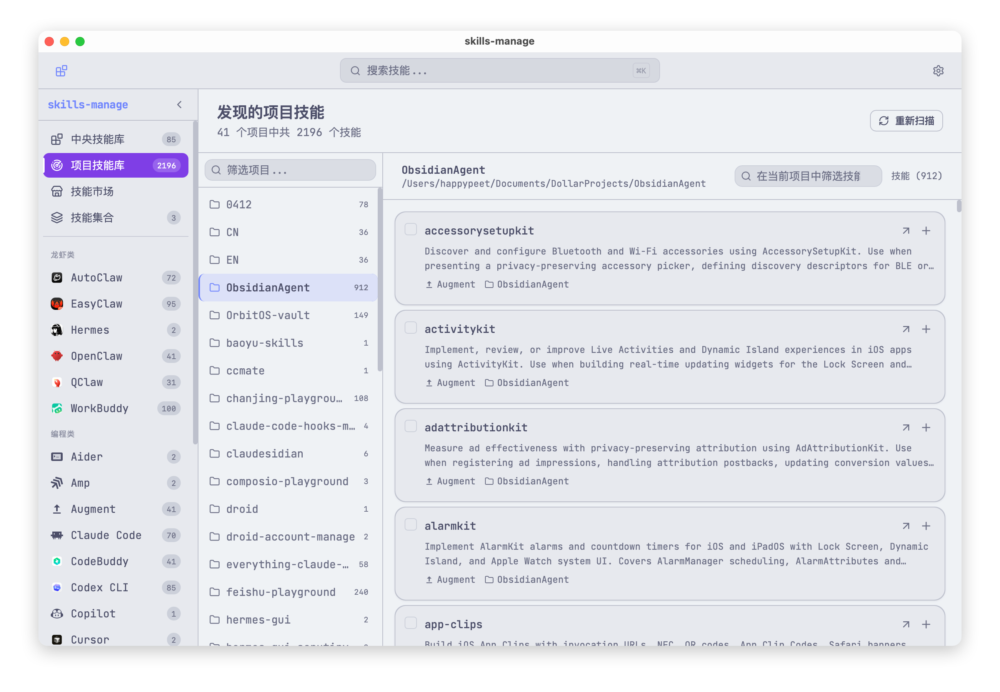
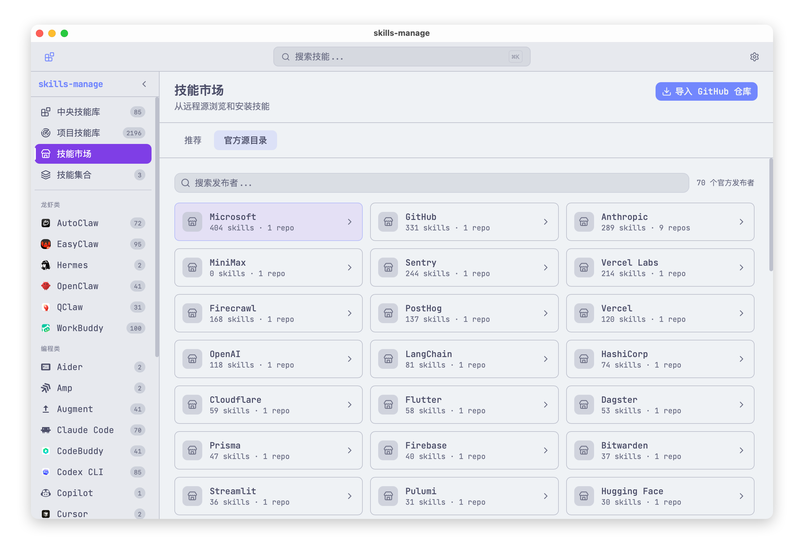
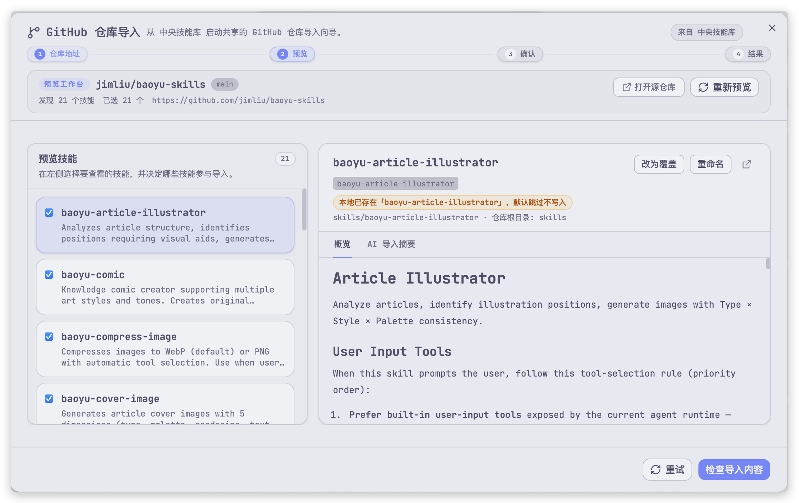
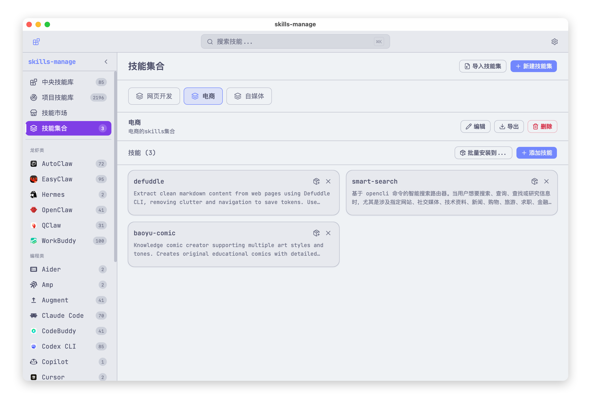

# skills-manage

`skills-manage` 是一个基于 Tauri 的桌面应用，用来在一个界面里统一管理多平台 AI coding agent skills。

[English Document](README.md)

> **项目来源说明**
>
> 本项目基于开源项目 [iamzhihuix/skills-manage](https://github.com/iamzhihuix/skills-manage) 进行二次开发与功能增强。

> **免责声明**
>
> `skills-manage` 是一个独立的桌面应用，用于管理本地 skill 目录并导入公开 skill 元数据。它与 Anthropic、OpenAI、GitHub、MiniMax 或其他受支持平台、发布方、商标所有者均无隶属、背书或赞助关系。

## 项目简介

`skills-manage` 遵循 [Agent Skills](https://github.com/anthropics/agent-skills) 的开放模式，使用 `~/.agents/skills/` 作为中央 canonical 目录，再通过符号链接把 skill 安装到各个平台，让同一份 skill 成为多个 AI coding 工具的单一事实来源。

## 本分支新增功能特性

相比原版，本版本重点增强了**项目技能库发现管理**与**批量操作工作流**：

- **项目技能复制到项目（跨项目技能同步）**：支持一键将某个项目中的平台 Skills 复制到另一个目标项目中，提供可视化冲突检查与预览，并支持跳过或覆盖已有技能。
- **项目技能永久删除**：支持在项目技能发现页对不需要的项目 Skill 进行 Shift+Delete 式直接物理删除，并提供二次安全确认弹窗。
- **项目技能直接加入技能集（不默认污染中央库）**：项目技能库中的 Skills 可直接加入技能集合（Collections），无需强制复制或安装到中央技能库（`~/.agents/skills/`），保留项目专属独立性。
- **批量选择与批量加入技能集**：支持在 Discover 界面多选/全选项目技能，一键批量加入一个或多个目标技能集合，并支持在弹窗内即时新建技能集合。

## 核心能力

- **中央技能库与多平台管理**：统一管理中央技能库，支持按平台一键安装与卸载。
- **Claude Code 深度集成**：在平台视图中同时呈现原生技能和只读 marketplace 插件技能。
- **完整技能详情视图**：支持 Markdown 预览、原始源码查看和 AI 解释生成。
- **技能集合（Collections）**：通过集合管理和组织技能，支持一键批量安装到指定平台或项目。
- **项目技能发现（Discover Scan）**：递归扫描本地项目级 skill 库，包括 Obsidian 笔记库（`.skills/`、`.agents/skills/`、`.claude/skills/`）。
- **技能市场与 GitHub 导入**：支持浏览远程 marketplace，支持通过 GitHub 仓库链接直接导入技能。
- **高性能搜索**：采用延迟查询、懒加载索引和虚拟滚动列表，轻松支持数千个技能流畅检索。
- **精致现代 UI**：中英文双语界面、Catppuccin 4 款精美主题、强调色自由切换、响应式交互设计。

## 项目截图

### 中央技能库与平台安装


### 查看特定平台的已安装技能



### 扫描本地项目技能库



### 浏览 marketplace 发布者与技能



### 从 GitHub 仓库导入技能



### 管理可复用技能集合



## 原项目仓库

- 原项目地址：<https://github.com/iamzhihuix/skills-manage>

## 支持的平台

| 类别 | 平台 | Skills 目录 |
|------|------|------------|
| Coding | Claude Code | `~/.claude/skills/` |
| Coding | Codex CLI | `~/.agents/skills/` |
| Coding | Cursor | `~/.cursor/skills/` |
| Coding | Gemini CLI | `~/.gemini/skills/` |
| Coding | Trae | `~/.trae/skills/` |
| Coding | Factory Droid | `~/.factory/skills/` |
| Coding | Junie | `~/.junie/skills/` |
| Coding | Qwen | `~/.qwen/skills/` |
| Coding | Trae CN | `~/.trae-cn/skills/` |
| Coding | Windsurf | `~/.windsurf/skills/` |
| Coding | Qoder | `~/.qoder/skills/` |
| Coding | Augment | `~/.augment/skills/` |
| Coding | OpenCode | `~/.opencode/skills/` |
| Coding | KiloCode | `~/.kilocode/skills/` |
| Coding | OB1 | `~/.ob1/skills/` |
| Coding | Amp | `~/.amp/skills/` |
| Coding | Kiro | `~/.kiro/skills/` |
| Coding | CodeBuddy | `~/.codebuddy/skills/` |
| Coding | Hermes | `~/.hermes/skills/` |
| Coding | Copilot | `~/.copilot/skills/` |
| Coding | Aider | `~/.aider/skills/` |
| Lobster | OpenClaw (开爪) | `~/.openclaw/skills/` |
| Lobster | QClaw (千爪) | `~/.qclaw/skills/` |
| Lobster | EasyClaw (简爪) | `~/.easyclaw/skills/` |
| Lobster | EasyClaw V2 | `~/.easyclaw-20260322-01/skills/` |
| Lobster | AutoClaw | `~/.openclaw-autoclaw/skills/` |
| Lobster | WorkBuddy (打工搭子) | `~/.workbuddy/skills-marketplace/skills/` |
| Central | Central Skills | `~/.agents/skills/` |

> 提示：Claude Code 还会将 `~/.claude/plugins/marketplaces/*` 下的 marketplace 插件目录作为只读项展示在 Claude 视图中。

自定义平台可在“设置”页面随时添加。

## 隐私与安全

- **本地优先存储** — 元数据、技能集合、扫描结果、设置项以及缓存的 AI 解释均保存在本地 `~/.skillsmanage/db.sqlite` 或所管理的本地 skill 目录中。
- **无数据遥测** — 本应用不包含任何分析统计、崩溃日志上报或用户追踪行为。
- **按需网络访问** — 仅在您主动执行 marketplace 同步/下载、GitHub 导入或 AI 解释生成时发起网络请求。
- **凭据本地存储** — GitHub Token 和 AI API Key 保存在本地 SQLite 设置表中，不会向外传输。

## 技术栈

| 层级 | 技术 |
|------|------|
| 桌面框架 | Tauri v2 |
| 前端 | React 19, TypeScript, Tailwind CSS 4 |
| UI 组件库 | shadcn/ui, Lucide icons |
| 状态管理 | Zustand |
| Markdown 渲染 | react-markdown |
| 国际化 | react-i18next, i18next-browser-languagedetector |
| 主题体系 | Catppuccin 4 种风味配色 |
| 后端 | Rust (serde, sqlx, chrono, uuid) |
| 数据库 | SQLite via sqlx (WAL mode) |
| 路由 | react-router-dom v7 |

## 开发与构建指南

### 环境准备

- [Node.js](https://nodejs.org/) (LTS)
- [pnpm](https://pnpm.io/)
- [Rust toolchain](https://rustup.rs/) (stable)
- Tauri v2 系统依赖: <https://v2.tauri.app/start/prerequisites/>

### 安装依赖

```bash
pnpm install
```

### 启动开发模式

```bash
pnpm tauri dev
```

### 构建打包安装程序

```bash
pnpm tauri build
```

构建生成的 Windows 安装程序（`.exe` / `.msi`）位于 `src-tauri/target/release/bundle/` 目录下。

### 代码检查与测试

```bash
pnpm test
pnpm typecheck
pnpm lint
cd src-tauri && cargo test
cd src-tauri && cargo clippy -- -D warnings
```

## 项目结构

```text
skills-manage/
├── src/                        # React 前端
│   ├── components/             # UI 组件
│   ├── i18n/                   # 国际化语言包
│   ├── lib/                    # 前端工具库
│   ├── pages/                  # 页面视图
│   ├── stores/                 # Zustand 状态库
│   ├── test/                   # 单元与集成测试
│   └── types/                  # TypeScript 类型定义
├── src-tauri/                  # Rust 后端
│   └── src/
│       ├── commands/           # Tauri IPC 命令
│       ├── db.rs               # SQLite Schema、迁移与数据层
│       ├── lib.rs              # Tauri 注册与初始化
│       └── main.rs             # 桌面端主入口
├── public/                     # 静态资源
├── CHANGELOG.md                # 英文更新日志
├── CHANGELOG.zh.md             # 中文更新日志
└── release-notes/              # GitHub 发布日志
```

## 开源协议

本项目采用 Apache License 2.0 开源协议，详情见 [LICENSE](LICENSE)。
